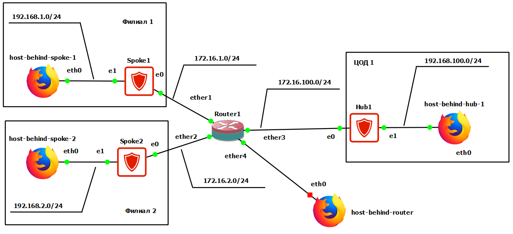
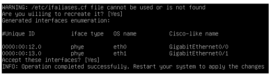

# 基于"星型"拓扑与中心重加密的《С-Терра Шлюз》安全网关间VPN隧道构建

在本实践任务中，需要配置总部与分支机构受保护子网之间的安全交互。通过采用国产行业标准GOST和IPsec协议进行流量加密和隧道化，实现安全交互。各分支机构受保护子网之间的安全交互通过总部的加密网关进行。所有其他连接被允许，但不会通过IPsec进行保护。在本场景中，将使用证书进行身份验证。作为加密提供商，将使用由《С-Терра СиЭсПи》公司开发的密码库。安全网关（或称加密网关）为《С-Терра Шлюз》4.3版。

## 基础设施要求

### 设备要求

1.1. 《С-Терра Шлюз》设备必须已完成初始化  
1.2. 作为 host-behind-… 可以使用任何功能类似个人计算机的设备（webterm-new, Kali Linux CLI, Linux CLI 等）  
1.3. 作为路由器可以使用 openwrt, MikroTik CHR 6.49.10 或 FRR  

### 网络交互要求

2.1. 实验台设备之间必须确保IP连通性

## 交互方案


   

## 总体工作逻辑

### 设备部署

1.1. 在总部部署：加密网关《С-Терра Шлюз》（Hub1）和个人计算机（host_behind_hub1）  
1.2. 在分支机构部署：加密网关《С-Терра Шлюз》（Spoke1和Spoke2）和个人计算机（host_behind_spoke1和host_behind_spoke2）  
1.3. 在非受控段部署：路由器（Router1）和个人计算机 host_behind_router  

### 互联网连接

在本场景中，使用路由器Router1模拟互联网  
2.1. 加密网关Hub1通过静态路由（通过路由器Router1的默认路由）连接到互联网  
2.2. 加密网关Spoke1和Spoke2通过静态路由（通过路由器Router1的默认路由）连接到互联网  

### 安全交互参数

总部子网（192.168.100.0/24）与分支机构子网（192.168.1.0/24和192.168.2.0/24）之间的所有IP流量都使用GOST算法和IPsec协议在隧道模式下进行保护

加密网关Hub1和Spoke1之间的安全连接可以由从分支机构子网（192.168.1.0/24）到总部子网（192.168.100.0/24）的流量以及反向流量发起，也可以由分支机构子网之间（192.168.1.0/24和192.168.2.0/24之间）的流量发起

加密网关Hub1和Spoke2之间的安全连接可以由从分支机构子网（192.168.2.0/24）到总部子网（192.168.100.0/24）的流量以及反向流量发起，也可以由分支机构子网之间（192.168.1.0/24和192.168.2.0/24之间）的流量发起

3.1. IKE协议参数：  
 - 使用数字证书进行身份验证，签名算法 - GOST Р 34.10-2012（256位密钥）  
 - 加密算法 - GOST 28147-89（256位密钥）  
 - 哈希函数计算算法 - GOST Р 34.11-2012 ТК26（256位密钥）  
 - 通用密钥生成算法（Diffie-Hellman算法类似物） - VKO_GOSTR3410_2012_256（256位密钥）  

3.2. ESP协议参数：  
 - 加密和完整性保护组合算法 - ESP_GOST-4M-IMIT（256位密钥）  

## 实验台配置

### 表1 - 实践任务中的符号说明

| 索引 | 含义 |
|------|------|
| X | 小组名单序号 |
| Y | 小组名单序号 + 1 |

### 配置设备 Router1

```
配置网络接口ether3的IP地址 - 172.16.100.Y 和掩码 - 255.255.255.0
配置网络接口ether1的IP地址 - 172.16.1.Y 和掩码 - 255.255.255.0
配置网络接口ether2的IP地址 - 172.16.2.Y 和掩码 - 255.255.255.0
配置网络接口ether4的IP地址 - 172.16.3.Y 和掩码 - 255.255.255.0
允许IPsec流量通过
```

### 配置设备 host_behind_hub1

```
配置网络接口的IP地址 - 192.168.100.100 和掩码 - 255.255.255.0
设置通过 192.168.100.X 的默认路由
允许接收和发送ICMP数据包
```

### 配置设备 host_behind_spoke1

```
配置网络接口的IP地址 - 192.168.1.100, 掩码 - 255.255.255.0
设置通过 192.168.1.X 的默认路由
允许接收和发送ICMP数据包
```

### 配置设备 host_behind_spoke2

```
配置网络接口的IP地址 - 192.168.2.100, 掩码 - 255.255.255.0
设置通过 192.168.2.X 的默认路由
允许接收和发送ICMP数据包
```

### 配置加密网关 Hub1

在配置IPsec之前，应根据之前的实践任务完成IKE配置

1. IPsec参数：

1.1. 创建总部和第一个分支机构之间需要保护的流量的访问控制列表（ACL）：

```cisco
Hub1(config)#ip access-list extended IPSEC_ACl_HUB1_AND_SPOKE1
Hub1(config-ext-nacl)#permit ip 192.168.100.0 0.0.0.255 192.168.1.0 0.0.0.255
Hub1(config-ext-nacl)#permit ip 192.168.2.0 0.0.0.255 192.168.1.0 0.0.0.255
Hub1(config-ext-nacl)#exit
Hub1(config)#
```

1.2. 创建总部和第二个分支机构之间需要保护的流量的访问控制列表（ACL）：

```cisco
Hub1(config)#ip access-list extended IPSEC_ACl_HUB1_AND_SPOKE2
Hub1(config-ext-nacl)#permit ip 192.168.100.0 0.0.0.255 192.168.2.0 0.0.0.255
Hub1(config-ext-nacl)#permit ip 192.168.1.0 0.0.0.255 192.168.2.0 0.0.0.255
Hub1(config-ext-nacl)#exit
Hub1(config)#
```

1.3. 为第一个分支机构创建加密映射（名称VPN，部分1）：

```cisco
Hub1(config)#crypto map VPN 1 ipsec-isakmp
```

1.3.1. 指定受保护流量的访问控制列表：

```cisco
Hub1(config-crypto-map)# match address IPSEC_ACl_HUB1_AND_SPOKE1
```

1.3.2. 指定应使用哪种算法集来保护流量：

```cisco
Hub1(config-crypto-map)# set transform-set GOST_ENCRYPT_AND_INTEGRITY
```

1.3.3. 指定IPsec对等体的IP地址，在本场景中为设备Spoke1的外部IP地址：

```cisco
Hub1(config-crypto-map)# set peer 172.16.1.X
```

1.3.4. 务必关闭远程隧道历史记录（如果不关闭，与位于NAT后的设备建立IPsec隧道可能会出现问题）：

```cisco
Hub1(config-crypto-map)# set dead-connection history off
Hub1(config-crypto-map)#exit
```

1.4. 为第二个分支机构添加加密映射（名称VPN，部分2）：

```cisco
Hub1(config)#crypto map VPN 2 ipsec-isakmp
```

1.4.1. 指定受保护流量的访问控制列表：

```cisco
Hub1(config-crypto-map)# match address IPSEC_ACl_HUB1_AND_SPOKE2
```

1.4.2. 指定应使用哪种算法集来保护流量：

```cisco
Hub1(config-crypto-map)# set transform-set GOST_ENCRYPT_AND_INTEGRITY
```

1.4.3. 指定IPsec对等体的IP地址，在本场景中为设备Spoke1的外部IP地址：

```cisco
Hub1(config-crypto-map)# set peer 172.16.2.X
```

1.4.4. 务必关闭远程隧道历史记录（如果不关闭，与位于NAT后的设备建立IPsec隧道可能会出现问题）：

```cisco
Hub1(config-crypto-map)# set dead-connection history off
Hub1(config-crypto-map)#exit
```

### 配置加密网关 Spoke1

加密网关Spoke1的配置与Hub1类似，使用访问控制列表（ACL）来保护总部和第一个分支机构之间或分支机构之间的流量

```cisco
Spoke1(config)#ip access-list extended IPSEC_ACl_HUB1_AND_SPOKE1
Spoke1(config-ext-nacl)#permit ip 192.168.1.0 0.0.0.255 192.168.100.0 0.0.0.255
Spoke1(config-ext-nacl)#permit ip 192.168.1.0 0.0.0.255 192.168.2.0 0.0.0.255
Spoke1(config-ext-nacl)#exit
Spoke1(config)#
```

### 配置加密网关 Spoke2

加密网关Spoke2的配置与Hub1类似，使用访问控制列表（ACL）来保护总部和第一个分支机构之间或分支机构之间的流量

```cisco
Spoke2(config)#ip access-list extended IPSEC_ACl_HUB1_AND_SPOKE2
Spoke2(config-ext-nacl)#permit ip 192.168.2.0 0.0.0.255 192.168.100.0 0.0.0.255
Spoke2(config-ext-nacl)#permit ip 192.168.2.0 0.0.0.255 192.168.1.0 0.0.0.255
Spoke2(config-ext-nacl)#exit
Spoke2(config)#
```

## 实验台功能验证

完成所有实验台设备配置后，需要执行功能验证

### IP连通性检查

1. 检查从加密网关Hub1、Spoke1和Spoke2是否可以通过ICMP访问默认网关（Router1）。为此，从加密网关的cisco-like控制台执行ping命令

```cisco
Hub1#ping 172.16.100.Y

PING 172.16.100.Y (172.16.100.Y) 100(128) bytes of data.
108 bytes from 172.16.100.Y: icmp_seq=1 ttl=64 time=0.384 ms
108 bytes from 172.16.100.Y: icmp_seq=2 ttl=64 time=0.409 ms
108 bytes from 172.16.100.Y: icmp_seq=3 ttl=64 time=0.365 ms
108 bytes from 172.16.100.Y: icmp_seq=4 ttl=64 time=0.389 ms
108 bytes from 172.16.100.Y: icmp_seq=5 ttl=64 time=0.393 ms

--- 172.16.100.Y ping statistics ---
5 packets transmitted, 5 received, 0% packet loss, time 4080ms
rtt min/avg/max/mdev = 0.365/0.388/0.409/0.014 ms
```

```cisco
Spoke1#ping 172.16.1.Y

PING 172.16.1.1 (172.16.1.Y) 100(128) bytes of data.
108 bytes from 172.16.1.Y: icmp_seq=1 ttl=64 time=0.286 ms
108 bytes from 172.16.1.Y: icmp_seq=2 ttl=64 time=0.231 ms
108 bytes from 172.16.1.Y: icmp_seq=3 ttl=64 time=0.435 ms
108 bytes from 172.16.1.Y: icmp_seq=4 ttl=64 time=0.454 ms
108 bytes from 172.16.1.Y: icmp_seq=5 ttl=64 time=0.432 ms

--- 172.16.1.Y ping statistics ---
5 packets transmitted, 5 received, 0% packet loss, time 4067ms
rtt min/avg/max/mdev = 0.231/0.367/0.454/0.093 ms
```

```cisco
Spoke2#ping 172.16.2.Y

PING 172.16.2.1 (172.16.2.Y) 100(128) bytes of data.
108 bytes from 172.16.2.Y: icmp_seq=1 ttl=64 time=0.299 ms
108 bytes from 172.16.2.Y: icmp_seq=2 ttl=64 time=1.06 ms
108 bytes from 172.16.2.Y: icmp_seq=3 ttl=64 time=0.313 ms
108 bytes from 172.16.2.Y: icmp_seq=4 ttl=64 time=0.455 ms
108 bytes from 172.16.2.Y: icmp_seq=5 ttl=64 time=0.261 ms

--- 172.16.2.Y ping statistics ---
5 packets transmitted, 5 received, 0% packet loss, time 4051ms
rtt min/avg/max/mdev = 0.261/0.479/1.067/0.301 ms
```

2. 检查从受保护设备Host_behind_spoke1、Host_behind_spoke2和Host_behind_hub1是否可以通过ICMP访问相应的作为默认网关的加密网关。为此，从受保护设备的linux bash控制台执行ping命令

```bash
root@Host_b_hub1:~# ping 192.168.100.X -c 5

PING 192.168.100.X (192.168.100.X) 56(84) bytes of data.
64 bytes from 192.168.100.X: icmp_seq=1 ttl=64 time=0.262 ms
64 bytes from 192.168.100.X: icmp_seq=2 ttl=64 time=0.299 ms
64 bytes from 192.168.100.X: icmp_seq=3 ttl=64 time=0.460 ms
64 bytes from 192.168.100.X: icmp_seq=4 ttl=64 time=0.287 ms
64 bytes from 192.168.100.X: icmp_seq=5 ttl=64 time=0.274 ms

--- 192.168.100.X ping statistics ---
5 packets transmitted, 5 received, 0% packet loss, time 81ms
rtt min/avg/max/mdev = 0.262/0.316/0.460/0.074 ms
```

```bash
root@Host_b_spoke1:~# ping 192.168.1.X -c 5

PING 192.168.1.X (192.168.1.X) 56(84) bytes of data.
64 bytes from 192.168.1.X: icmp_seq=1 ttl=64 time=0.302 ms
64 bytes from 192.168.1.X: icmp_seq=2 ttl=64 time=0.257 ms
64 bytes from 192.168.1.X: icmp_seq=3 ttl=64 time=0.305 ms
64 bytes from 192.168.1.X: icmp_seq=4 ttl=64 time=0.354 ms
64 bytes from 192.168.1.X: icmp_seq=5 ttl=64 time=0.335 ms

--- 192.168.1.1 ping statistics ---
5 packets transmitted, 5 received, 0% packet loss, time 59ms
rtt min/avg/max/mdev = 0.257/0.310/0.354/0.038 ms
```

```bash
root@Host_b_spoke2:~# ping 192.168.2.X -c 5

PING 192.168.2.X (192.168.2.X) 56(84) bytes of data.
64 bytes from 192.168.2.X: icmp_seq=1 ttl=64 time=0.292 ms
64 bytes from 192.168.2.X: icmp_seq=2 ttl=64 time=0.250 ms
64 bytes from 192.168.2.X: icmp_seq=3 ttl=64 time=0.391 ms
64 bytes from 192.168.2.X: icmp_seq=4 ttl=64 time=0.308 ms
64 bytes from 192.168.2.X: icmp_seq=5 ttl=64 time=0.363 ms

--- 192.168.2.X ping statistics ---
5 packets transmitted, 5 received, 0% packet loss, time 77ms
rtt min/avg/max/mdev = 0.250/0.320/0.391/0.055 ms
```

3. 检查从加密网关Hub1是否可以通过ICMP访问加密网关Spoke1和加密网关Spoke2（通过外部接口）。为此，从加密网关的cisco-like控制台执行ping命令

```cisco
Hub1#ping 172.16.1.X

PING 172.16.1.X (172.16.1.X) 100(128) bytes of data.
108 bytes from 172.16.1.X: icmp_seq=1 ttl=63 time=0.701 ms
108 bytes from 172.16.1.X: icmp_seq=2 ttl=63 time=0.806 ms
108 bytes from 172.16.1.X: icmp_seq=3 ttl=63 time=0.728 ms
108 bytes from 172.16.1.X: icmp_seq=4 ttl=63 time=0.688 ms
108 bytes from 172.16.1.X: icmp_seq=5 ttl=63 time=0.704 ms

--- 172.16.1.X ping statistics ---
5 packets transmitted, 5 received, 0% packet loss, time 4020ms
rtt min/avg/max/mdev = 0.688/0.725/0.806/0.048 ms
```

```cisco
Hub1#ping 172.16.2.X

PING 172.16.2.X (172.16.2.X) 100(128) bytes of data.
108 bytes from 172.16.2.X: icmp_seq=1 ttl=63 time=0.817 ms
108 bytes from 172.16.2.X: icmp_seq=2 ttl=63 time=0.859 ms
108 bytes from 172.16.2.X: icmp_seq=3 ttl=63 time=0.850 ms
108 bytes from 172.16.2.X: icmp_seq=4 ttl=63 time=1.64 ms
108 bytes from 172.16.2.X: icmp_seq=5 ttl=63 time=0.730 ms

--- 172.16.2.X ping statistics ---
5 packets transmitted, 5 received, 0% packet loss, time 4031ms
rtt min/avg/max/mdev = 0.730/0.980/1.648/0.339 ms
```

### PKI检查

1. 检查加密网关Hub1、Spoke1和Spoke2上的CA证书是否已导入产品数据库。为此，从加密网关的cisco-like控制台执行命令 `run cert_mgr show`

```cisco
Hub1#run cert_mgr show

Found 2 certificates. Found 1 CRL.
1 Status: local   C=RU,L=Zelenograd,O=S-Terra CSP,OU=RnD,CN=Hub1
2 Status: trusted C=RU,L=Zelenograd,O=S-Terra CSP,OU=RnD,CN=S-Terra CSP Test Root CA
3 CRL: C=RU,L=Zelenograd,O=S-Terra CSP,OU=RnD,CN=S-Terra CSP Test Root CA
```

```cisco
Spoke1#run cert_mgr show

Found 2 certificates. Found 1 CRL.
1 Status: trusted C=RU,L=Zelenograd,O=S-Terra CSP,OU=RnD,CN=S-Terra CSP Test Root CA
2 Status: local   C=RU,L=Zelenograd,O=S-Terra CSP,OU=RnD,CN=Spoke1
3 CRL: C=RU,L=Zelenograd,O=S-Terra CSP,OU=RnD,CN=S-Terra CSP Test Root CA
```

```cisco
Spoke2#run cert_mgr show

Found 2 certificates. Found 1 CRL.
1 Status: trusted C=RU,L=Zelenograd,O=S-Terra CSP,OU=RnD,CN=S-Terra CSP Test Root CA
2 Status: local   C=RU,L=Zelenograd,O=S-Terra CSP,OU=RnD,CN=Spoke2
3   CRL: C=RU,L=Zelenograd,O=S-Terra CSP,OU=RnD,CN=S-Terra CSP Test Root CA
```

2. 检查加密网关Hub1和Spoke1上所有证书的状态是否为Active。为此，从加密网关的cisco-like控制台执行命令 `run cert_mgr check`

```cisco
Hub1#run cert_mgr check

1 State: Active   C=RU,L=Zelenograd,O=S-Terra CSP,OU=RnD,CN=Hub1
2 State: Active   C=RU,L=Zelenograd,O=S-Terra CSP,OU=RnD,CN=S-Terra CSP Test Root CA
```

```cisco
Spoke1#run cert_mgr check

1 State: Active   C=RU,L=Zelenograd,O=S-Terra CSP,OU=RnD,CN=S-Terra CSP Test Root CA
2 State: Active   C=RU,L=Zelenograd,O=S-Terra CSP,OU=RnD,CN=Spoke1
```

```cisco
Spoke2#run cert_mgr check

1 State: Active   C=RU,L=Zelenograd,O=S-Terra CSP,OU=RnD,CN=S-Terra CSP Test Root CA
2 State: Active   C=RU,L=Zelenograd,O=S-Terra CSP,OU=RnD,CN=Spoke2
```

### 检查Hub1和Spoke1子网之间安全连接的建立

1. 通过从设备Host_behind_spoke2向Host_behind_hub1发送ICMP流量（或反向），发起加密网关Hub1和Spoke2之间的安全连接建立。为此，从受保护设备Host_behind_spoke2的linux bash控制台执行ping命令

```bash
root@Host_b_spoke2:~# ping 192.168.100.100 -c 5

PING 192.168.100.100 (192.168.100.100) 56(84) bytes of data.
64 bytes from 192.168.100.100: icmp_seq=1 ttl=62 time=953 ms
64 bytes from 192.168.100.100: icmp_seq=2 ttl=62 time=5.11 ms
64 bytes from 192.168.100.100: icmp_seq=3 ttl=62 time=1.58 ms
64 bytes from 192.168.100.100: icmp_seq=4 ttl=62 time=1.45 ms
64 bytes from 192.168.100.100: icmp_seq=5 ttl=62 time=1.79 ms

--- 192.168.100.100 ping statistics ---
5 packets transmitted, 5 received, 0% packet loss, time 8ms
rtt min/avg/max/mdev = 1.445/192.634/953.245/380.307 ms
```

2. 检查加密网关Hub1和Spoke2上是否已建立安全的IPsec连接。为此，从加密网关的cisco-like控制台执行命令 `run sa_mgr show`

```cisco
Hub1#run sa_mgr show

ISAKMP sessions: 0 initiated, 0 responded

ISAKMP connections:
Num Conn-id (Local Addr,Port)-(Remote Addr,Port) State Sent Rcvd
1 1 (172.16.100.2,500)-(172.16.1.2,500) active 1828 1908
2 2 (172.16.100.2,500)-(172.16.2.2,500) active 1828 1908

IPsec connections:
Num Conn-id (Local Addr,Port)-(Remote Addr,Port) Protocol Action Type Sent Rcvd
1 1 (192.168.100.0-192.168.100.255,*)-(192.168.1.0-192.168.1.255,*) * ESP tunn 440 440
2 2 (192.168.100.0-192.168.100.255,*)-(192.168.2.0-192.168.2.255,*) * ESP tunn 440 440
```

```cisco
Spoke2#run sa_mgr show

ISAKMP sessions: 0 initiated, 0 responded

ISAKMP connections:
Num Conn-id (Local Addr,Port)-(Remote Addr,Port) State Sent Rcvd
1 1 (172.16.2.2,500)-(172.16.100.2,500) active 1908 1828

IPsec connections:
Num Conn-id (Local Addr,Port)-(Remote Addr,Port) Protocol Action Type Sent Rcvd
1 1 (192.168.2.0-192.168.2.255,*)-(192.168.100.0-192.168.100.255,*) * ESP tunn 440 440
```

### 检查Spoke1和Spoke2子网之间安全连接的建立

1. 通过从设备Host_behind_spoke1向Host_behind_spoke2发送ICMP流量（或反向），发起加密网关Spoke1和Spoke2之间的安全连接建立。为此，从受保护设备Host_behind_spoke1的linux bash控制台执行ping命令

```bash
root@Host_b_spoke1:~# ping 192.168.2.100 -c 5

PING 192.168.2.100 (192.168.2.100) 56(84) bytes of data.
64 bytes from 192.168.2.100: icmp_seq=1 ttl=61 time=660 ms
64 bytes from 192.168.2.100: icmp_seq=2 ttl=61 time=3.41 ms
64 bytes from 192.168.2.100: icmp_seq=3 ttl=61 time=2.55 ms
64 bytes from 192.168.2.100: icmp_seq=4 ttl=61 time=2.41 ms
64 bytes from 192.168.2.100: icmp_seq=5 ttl=61 time=2.05 ms

--- 192.168.2.100 ping statistics ---
5 packets transmitted, 5 received, 0% packet loss, time 9ms
rtt min/avg/max/mdev = 2.047/134.098/660.074/262.988 ms
```

2. 检查加密网关Hub1、Spoke1和Spoke2上是否已建立安全的IPsec连接。为此，从加密网关的cisco-like控制台执行命令 `run sa_mgr show`

```cisco
Hub1#run sa_mgr show

ISAKMP sessions: 0 initiated, 0 responded

ISAKMP connections:
Num Conn-id (Local Addr,Port)-(Remote Addr,Port) State Sent Rcvd
1 1 (172.16.100.2,500)-(172.16.1.2,500) active 2172 2252
2 2 (172.16.100.2,500)-(172.16.2.2,500) active 2172 2252

IPsec connections:
Num Conn-id (Local Addr,Port)-(Remote Addr,Port) Protocol Action Type Sent Rcvd
1 1 (192.168.100.0-192.168.100.255,*)-(192.168.1.0-192.168.1.255,*) * ESP tunn 440 440
2 2 (192.168.100.0-192.168.100.255,*)-(192.168.2.0-192.168.2.255,*) * ESP tunn 440 440
3 3 (192.168.2.0-192.168.2.255,*)-(192.168.1.0-192.168.1.255,*) * ESP tunn 440 440
4 4 (192.168.1.0-192.168.1.255,*)-(192.168.2.0-192.168.2.255,*) * ESP tunn 440 440
```

```cisco
Spoke1#run sa_mgr show

ISAKMP sessions: 0 initiated, 0 responded

ISAKMP connections:
Num Conn-id (Local Addr,Port)-(Remote Addr,Port) State Sent Rcvd
1 1 (172.16.1.2,500)-(172.16.100.2,500) active 2252 2172

IPsec connections:
Num Conn-id (Local Addr,Port)-(Remote Addr,Port) Protocol Action Type Sent Rcvd
1 1 (192.168.1.0-192.168.1.255,*)-(192.168.100.0-192.168.100.255,*) * ESP tunn 440 440
2 2 (192.168.1.0-192.168.1.255,*)-(192.168.2.0-192.168.2.255,*) * ESP tunn 440 440
```

```cisco
Spoke2#run sa_mgr show

ISAKMP sessions: 0 initiated, 0 responded

ISAKMP connections:
Num Conn-id (Local Addr,Port)-(Remote Addr,Port) State Sent Rcvd
1 1 (172.16.2.2,500)-(172.16.100.2,500) active 2252 2172

IPsec connections:
Num Conn-id (Local Addr,Port)-(Remote Addr,Port) Protocol Action Type Sent Rcvd
1 1 (192.168.2.0-192.168.2.255,*)-(192.168.100.0-192.168.100.255,*) * ESP tunn 440 440
2 2 (192.168.2.0-192.168.2.255,*)-(192.168.1.0-192.168.1.255,*) * ESP tunn 440 440
```
```
