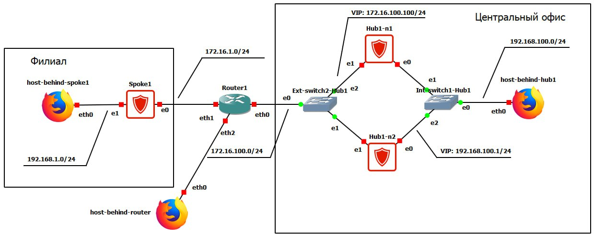

# 基于VRRP协议的容错解决方案配置（通过cisco-like控制台）

本实践任务包含通过cisco-like控制台配置《С-Терра》容错集群的示例。该场景还描述了总部与分支机构受保护子网之间的安全交互配置。通过采用国产行业标准GOST和IPsec协议进行流量加密和隧道化，实现安全交互。

## 基础设施要求

### 设备要求

1.1. 《С-Терра》设备必须已完成初始化  
1.2. 作为 host-behind-… 可以使用任何功能类似个人计算机的设备（webterm-new, Kali Linux CLI, Linux CLI 等）  
1.3. 作为 Router1 和 Hub1_Router 可以使用 openwrt, MikroTik CHR 6.49.10 或 FRR  
1.4. 作为交换机使用 Ethernet Switch  

### 网络交互要求

2.1. 实验台设备之间必须确保IP连通性

## 交互方案



*图 1 - 网络拓扑*
## 总体工作逻辑

### 设备部署

1.1. 在总部部署：两个加密网关《С-Терра》（Hub1-n1和Hub1-n2）、两个交换机（Int_switch1_Hub1和Ext_switch2_Hub1）和个人计算机（host_behind_hub1）  
1.2. 在分支机构部署：加密网关《С-Терра》（Spoke1）和个人计算机（host_behind_spoke1）  
1.3. 在非受控段部署：路由器（Router1）和个人计算机 host_behind_router  

### 互联网连接

在本场景中，使用路由器Router1模拟互联网  
如果通过ICMP协议（或"ping"）能够访问host_behind_router，则认为《С-Терра》设备的互联网连接成功  
2.1. 加密网关Hub1-n1和Hub1-n2组成的集群通过静态路由（通过路由器Router1的默认路由）连接到互联网  
2.2. 加密网关Spoke1通过静态路由（通过路由器Router1的默认路由）连接到互联网  

### 容错集群

3.1. 加密网关Hub1-n1和Hub1-n2组成基于VRRP协议的Master/Backup模式容错集群。VRRP协议由"keepalived"软件实现  
3.2. 加密网关Hub1-n1和Hub1-n2是集群节点  
3.3. 集群节点之间的配置不同步。在一节点上更改设置时，需要在另一节点上执行类似设置  
3.4. 处于Master状态的节点拥有受信任和非受信任段的VIP地址，并相应处理流量。处于Backup或Fault状态的节点不拥有VIP地址  
3.5. 默认情况下，所有VRRP接口都同步到零号组。因此，它们同时改变状态（此行为与Cisco IOS不同，在Cisco IOS中VRRP接口默认不同步）  
3.6. 故障检测通过VRRP协议的服务数据包（VRRP Advertisement messages）实现。服务数据包仅由处于Master状态的节点发送（数据包源地址 - 启用VRRP的接口上的主IP地址；目标IP地址 - 224.0.0.18）。如果处于Backup状态的备用节点在所有同步接口上停止接收来自主节点的VRRP Advertisement messages数据包，则它将获取Master角色  
3.7. 当节点转换到Master状态时，添加通过路由器Router1的默认路由（在cisco-like控制台中使用命令`vrrp ip route …`）（当转换到Backup或Fault状态时删除）  
3.8. 当节点转换到Backup或Fault状态时，添加通过处于Master状态节点的受信任段VIP地址的默认路由（用于通过活动节点远程访问备用节点的目的）。通过文件`/etc/keepalived/notify_common.conf`配置路由添加，该文件管理脚本`/etc/keepalived/scripts/notify_common`。通过在cisco-like控制台中使用命令`vrrp notify common`实现在集群状态转换期间启动此脚本  
3.9. 集群节点上关闭了preempt mode - 这意味着具有较高优先级的节点不会从具有较低优先级的工作节点那里获取Master角色。此设置有助于避免不必要的切换  
3.10. 集群处理以下类型的故障：  
 - 电源故障  
 - 硬件平台故障  
 - 硬件平台网络端口故障  
 - 交换设备网络端口故障  
 - 提供IPsec隧道构建的vpngate服务故障  
 - 平均切换时间为15秒  

### 源地址转换（source NAT）

4.1. 在此场景中，仅在总部的集群节点上执行Source NAT（如果需要在分支网关Spoke1上配置source NAT，请按类似方式操作）。源地址转换为集群VIP地址172.16.100.100  
4.2. 一般情况下，假设分发证书撤销列表的HTTP服务器位于互联网中。考虑到需要确保集群备用节点上定期更新证书撤销列表，需要使其能够访问互联网（注意：处于Backup或Fault状态的节点通过处于Master状态的节点访问互联网）。因此，必须在节点上配置source NAT。配置使用操作系统附带的iptables和netfilter-persistent实用程序进行  
4.3. 为确保source NAT在《С-Терра Шлюз》上正常工作，实现以下条件：  
 - 为以下数据包禁用Source NAT：  
 - 本地IKE/ESP/NAT-T数据包  
 - 本地VRRP数据包  
 - 所有应加密的数据包  
 - 将第三方设备的传输IPsec流量的IKE/NAT-T数据包的源端口从500更改为40500-40540，从4500更改为44500-44540（因为端口500和4500在《С-Терра Шлюз》上默认使用）  

### 安全交互参数

总部子网（192.168.100.0/24）与分支机构子网（192.168.1.0/24）之间的所有IP流量都使用GOST算法和IPsec协议在隧道模式下进行保护

安全连接可以由从子网192.168.1.0/24到192.168.100.0/24（从分支机构到总部）的流量发起，也可以由从总部到分支机构的反向流量发起

5.1. IKE协议参数：  
 - 使用数字证书进行身份验证，签名算法 - GOST Р 34.10-2012（256位密钥）  
 - 加密算法 - GOST 28147-89（256位密钥）  
 - 哈希函数计算算法 - GOST Р 34.11-2012 ТК26（256位密钥）  
 - 通用密钥生成算法（Diffie-Hellman算法类似物） - VKO_GOSTR3410_2012_256（256位密钥）  

5.2. ESP协议参数：  
 - 加密和完整性保护组合算法 - ESP_GOST-4M-IMIT（256位密钥）  

## 实验台配置

### 表1 - 实践任务中的符号说明

| 索引 | 含义 |
|------|------|
| X | 小组名单序号 |
| Y | 小组名单序号 + 1 |

### 配置设备 Router1

```
配置网络接口ether1的IP地址 - 172.16.1.Y 和掩码 - 255.255.255.0
配置网络接口ether0的IP地址 - 172.16.100.Y 和掩码 - 255.255.255.0
允许IPsec流量通过
```

### 配置设备 host_behind_hub1

```
配置网络接口的IP地址 - 192.168.100.100 和掩码 - 255.255.255.0
设置通过192.168.100.X的默认路由
允许接收和发送ICMP数据包
```

### 配置设备 host_behind_spoke1

```
配置网络接口的IP地址 - 192.168.1.100, 掩码 - 255.255.255.0
设置通过192.168.1.X的默认路由
允许接收和发送ICMP数据包
```

### 配置加密网关 Hub1-n1（集群主节点）

```
完成设备初始化
生成私钥并请求加密网关证书
在CA上颁发加密网关证书，并将CA证书和加密网关证书导入S-Gate数据库
配置网络接口ether1的IP地址 - 172.16.100.X 和掩码 255.255.255.0
配置网络接口ether0的IP地址 - 192.168.100.X 和掩码 255.255.255.0
根据之前的实践任务配置IKE
配置IPsec并将创建的加密映射附加到外部接口GigabitEthernet0/0
根据说明配置VRRP
根据说明配置源地址转换（source NAT）
```

### 配置加密网关 Hub1-n2（集群备用节点）

加密网关Hub1-n2的配置与Hub1-n1类似  
接口上的VRRP优先级应较低（50而不是100），命令`vrrp priority 50`

### 配置加密网关 Spoke1

加密网关Spoke1的配置与Hub1-n1类似，除了：  
 - VRRP配置  
 - source NAT配置

## 实验台功能验证

1. 确保主节点Hub1-n1处于Master状态，备用节点Hub1-n2处于Backup状态，为此从cisco-like控制台执行以下命令：

```cisco
Hub1-n1#show vrrp
Interface                      VRID  State
-------------------------------------------
GigabitEthernet0/0             1     Master
GigabitEthernet0/1             2     Master
```

```cisco
Hub1-n2#show vrrp
Interface                      VRID  State
-------------------------------------------
GigabitEthernet0/0             1     Backup
GigabitEthernet0/1             2     Backup
```

2. 确保主节点Hub1-n1有通过Router1的默认路由，而备用节点Hub1-n2有通过受信任段VIP地址的默认路由：

```cisco
Hub1-n1#show ip route
Codes: C - connected, S - static, R - RIP, M - mobile, B - BGP
       D - EIGRP, EX - EIGRP external, O - OSPF, IA - OSPF inter area
       N1 - OSPF NSSA external type 1, N2 - OSPF NSSA external type 2
       E1 - OSPF external type 1, E2 - OSPF external type 2
       i - IS-IS, su - IS-IS summary, L1 - IS-IS level-1, L2 - IS-IS level-2
       ia - IS-IS inter area, * - candidate default, U - per-user static route
       o - ODR, P - periodic downloaded static route

Gateway of last resort is 172.16.100.1 to network 0.0.0.0

S*   0.0.0.0/0 [1/0] via 172.16.100.1
     172.16.0.0/24 is subnetted, 1 subnets
C       172.16.100.0 is directly connected, GigabitEthernet0/0
C    192.168.100.0/24 is directly connected, GigabitEthernet0/1
```

```cisco
Hub1-n2#show ip route
Codes: C - connected, S - static, R - RIP, M - mobile, B - BGP
       D - EIGRP, EX - EIGRP external, O - OSPF, IA - OSPF inter area
       N1 - OSPF NSSA external type 1, N2 - OSPF NSSA external type 2
       E1 - OSPF external type 1, E2 - OSPF external type 2
       i - IS-IS, su - IS-IS summary, L1 - IS-IS level-1, L2 - IS-IS level-2
       ia - IS-IS inter area, * - candidate default, U - per-user static route
       o - ODR, P - periodic downloaded static route

Gateway of last resort is 192.168.100.1 to network 0.0.0.0

S*   0.0.0.0/0 [1/0] via 192.168.100.1
     172.16.0.0/24 is subnetted, 1 subnets
C       172.16.100.0 is directly connected, GigabitEthernet0/0
C    192.168.100.0/24 is directly connected, GigabitEthernet0/1
```

3. 确保主节点Hub1-n1和备用节点Hub1-n2成功加载了证书

```cisco
Hub1-n1#run cert_mgr show
Found 2 certificates.
1 Status: local   C=RU,L=Zelenograd,O=S-Terra CSP,OU=RnD,CN=Hub1-n1
2 Status: trusted C=RU,L=Zelenograd,O=S-Terra CSP,OU=RnD,CN=S-Terra CSP Test Root CA
```

```cisco
Hub1-n2#run cert_mgr show
Found 2 certificates.
1 Status: local   C=RU,L=Zelenograd,O=S-Terra CSP,OU=RnD,CN=Hub1-n2
2 Status: trusted C=RU,L=Zelenograd,O=S-Terra CSP,OU=RnD,CN=S-Terra CSP Test Root CA
```

4. 确保集群主节点Hub1-n1与分支机构加密网关Spoke1之间的IPsec隧道成功建立。为此执行以下操作：

4.1. 从host_behind_spoke1设备向host_behind_hub1设备发送应加密的流量，例如：

```bash
root@Host_b_spoke1:~# ping 192.168.100.100 -c 5
PING 192.168.100.100 (192.168.100.100) 56(84) bytes of data.
64 bytes from 192.168.100.100: icmp_seq=1 ttl=62 time=304 ms
64 bytes from 192.168.100.100: icmp_seq=2 ttl=62 time=0.707 ms
64 bytes from 192.168.100.100: icmp_seq=3 ttl=62 time=0.784 ms
64 bytes from 192.168.100.100: icmp_seq=4 ttl=62 time=0.788 ms
64 bytes from 192.168.100.100: icmp_seq=5 ttl=62 time=0.734 ms

--- 192.168.100.100 ping statistics ---
5 packets transmitted, 5 received, 0% packet loss, time 4065ms
rtt min/avg/max/mdev = 0.707/61.409/304.034/121.312 ms
```

4.2. 检查Hub1-n1和Spoke1上的IPsec隧道状态：

```cisco
Hub1-n1#run sa_mgr show
ISAKMP connections:
Num Conn-id (Local Addr,Port)-(Remote Addr,Port) State Sent Rcvd
1 5 (172.16.100.100,500)-(172.16.1.2,500) active 1820 1788

IPsec connections:
Num Conn-id (Local Addr,Port)-(Remote Addr,Port) Protocol Action Type Sent Rcvd
1 1 (192.168.100.0-192.168.100.255,*)-(192.168.1.0-192.168.1.255,*) * ESP tunn 440 440
```

```cisco
Spoke1#run sa_mgr show
ISAKMP sessions: 0 initiated, 0 responded

ISAKMP connections:
Num Conn-id (Local Addr,Port)-(Remote Addr,Port) State Sent Rcvd
1 3 (172.16.1.2,500)-(172.16.100.100,500) active 1788 1820

IPsec connections:
Num Conn-id (Local Addr,Port)-(Remote Addr,Port) Protocol Action Type Sent Rcvd
1 3 (192.168.1.0-192.168.1.255,*)-(192.168.100.0-192.168.100.255,*) * ESP tunn 440 440
```

```cisco
Hub1-n2#run sa_mgr show
ISAKMP sessions: 0 initiated, 0 responded
```

5. 模拟主节点Hub1-n1上的故障，例如断开接口GigabitEthernet0/0的网络电缆，并确保Master角色已切换到Hub1-n2：

```cisco
Hub1-n1#show interfaces gigabitEthernet 0/0
GigabitEthernet0/0 is up, line protocol is down
  Hardware address is 0050.569e.b06d
  Internet address is 172.16.100.10/24
  MTU 1500 bytes
```

```cisco
Hub1-n1#show vrrp
Interface                      VRID  State
-------------------------------------------
GigabitEthernet0/0             1     Fault
GigabitEthernet0/1             2     Fault
```

```cisco
Hub1-n2#show vrrp
Interface                      VRID  State
-------------------------------------------
GigabitEthernet0/0             1     Master
GigabitEthernet0/1             2     Master
```

6. 确保集群备用节点Hub1-n2与分支机构加密网关Spoke1之间的IPsec隧道成功建立。为此执行以下操作：

6.1 从host_behind_spoke1设备向host_behind_hub1设备发送应加密的流量，例如：

```bash
root@Host_b_spoke1:~# ping 192.168.100.100 -c 5
PING 192.168.100.100 (192.168.100.100) 56(84) bytes of data.

--- 192.168.100.100 ping statistics ---
5 packets transmitted, 0 received, 100% packet loss, time 4086ms
root@Host_b_spoke1:~# ping 192.168.100.100 -c 5
PING 192.168.100.100 (192.168.100.100) 56(84) bytes of data.
64 bytes from 192.168.100.100: icmp_seq=1 ttl=62 time=442 ms
64 bytes from 192.168.100.100: icmp_seq=2 ttl=62 time=0.811 ms
64 bytes from 192.168.100.100: icmp_seq=3 ttl=62 time=0.750 ms
64 bytes from 192.168.100.100: icmp_seq=4 ttl=62 time=0.756 ms
64 bytes from 192.168.100.100: icmp_seq=5 ttl=62 time=0.822 ms

--- 192.168.100.100 ping statistics ---
5 packets transmitted, 5 received, 0% packet loss, time 4056ms
rtt min/avg/max/mdev = 0.750/89.065/442.187/176.561 ms
```

6.2 检查Hub1-n2和Spoke1上的IPsec隧道（Hub1-n1上不应有IPsec隧道）：

```cisco
Hub1-n1#run sa_mgr show
ISAKMP sessions: 0 initiated, 0 responded
```

```cisco
Spoke1#run sa_mgr show
ISAKMP sessions: 0 initiated, 0 responded

ISAKMP connections:
Num Conn-id (Local Addr,Port)-(Remote Addr,Port) State Sent Rcvd
1 4 (172.16.1.2,500)-(172.16.100.100,500) active 1788 1716

IPsec connections:
Num Conn-id (Local Addr,Port)-(Remote Addr,Port) Protocol Action Type Sent Rcvd
1 4 (192.168.1.0-192.168.1.255,*)-(192.168.100.0-192.168.100.255,*) * ESP tunn 440 440
```

```cisco
Hub1-n2#run sa_mgr show
ISAKMP sessions: 0 initiated, 0 responded

ISAKMP connections:
Num Conn-id (Local Addr,Port)-(Remote Addr,Port) State Sent Rcvd
1 5 (172.16.100.100,500)-(172.16.1.2,500) active 1716 1788

IPsec connections:
Num Conn-id (Local Addr,Port)-(Remote Addr,Port) Protocol Action Type Sent Rcvd
1 1 (192.168.100.0-192.168.100.255,*)-(192.168.1.0-192.168.1.255,*) * ESP tunn 440 440
```

7. 修复主节点Hub1-n1上的故障原因，并确保它从Fault状态转换为Backup状态，同时检查通过受信任段VIP地址的默认路由是否存在：
节点Hub1-n1不会获取Master角色（只要节点Hub1-n2正常运行），因为preempt mode已关闭。

```cisco
Hub1-n1#show interfaces GigabitEthernet 0/0
GigabitEthernet0/0 is up, line protocol is up
  Hardware address is 0050.569e.b06d
  Internet address is 172.16.100.10/24
  MTU 1500 bytes
```

```cisco
Hub1-n1#show vrrp

Interface                      VRID  State
-------------------------------------------
GigabitEthernet0/0             1     Backup
GigabitEthernet0/1             2     Backup
```

```cisco
Hub1-n1#show ip route
Codes: C - connected, S - static, R - RIP, M - mobile, B - BGP
       D - EIGRP, EX - EIGRP external, O - OSPF, IA - OSPF inter area
       N1 - OSPF NSSA external type 1, N2 - OSPF NSSA external type 2
       E1 - OSPF external type 1, E2 - OSPF external type 2
       i - IS-IS, su - IS-IS summary, L1 - IS-IS level-1, L2 - IS-IS level-2
       ia - IS-IS inter area, * - candidate default, U - per-user static route
       o - ODR, P - periodic downloaded static route

Gateway of last resort is 192.168.100.1 to network 0.0.0.0

S*   0.0.0.0/0 [1/0] via 192.168.100.1
     172.16.0.0/24 is subnetted, 1 subnets
C       172.16.100.0 is directly connected, GigabitEthernet0/0
C    192.168.100.0/24 is directly connected, GigabitEthernet0/1
```

可见，从主节点到备用节点的切换工作正常。

## 配置说明

说明中的IP地址作为示例给出。要完成实践任务，需要使用根据变体分配的地址。

### VRRP配置

VRRP配置包括两个阶段。第一阶段 - 准备配置文件`/etc/keepalived/notify_common.conf`，该文件负责管理脚本`/etc/keepalived/scripts/notify_common`。第二阶段 - 从cisco-like控制台配置VRRP。

将文件`/etc/keepalived/notify_common.conf`设置为以下形式：
需要配置此配置文件，以便处于Backup或Fault状态的备用节点可以通过活动节点访问指定子网（在此场景中为互联网）。

```bash
Hub1-n1#run nano /etc/keepalived/notify_common.conf
FLAG_MANAGE_ROUTES="true"
RESERVE_ROUTES="0.0.0.0/0"
RESERVE_NEXTHOP="192.168.100.1"
RESERVE_METRIC="1"
```

在已运行的集群节点上更改这些参数时，需要重新启动keepalived服务：

```bash
Hub1-n1# run systemctl restart keepalived.service
```

参数说明：  
 - FLAG_MANAGE_ROUTES - 负责管理在变量RESERVE_ROUTES中指定的备用路由的标志。如果标志值为true，则在Backup和Fault状态下将变量RESERVE_ROUTES中指定的路由添加到路由表，在Master状态下删除。如果标志值为false，则不管理备用路由  
 - RESERVE_ROUTES - 变量，指定在Backup和Fault状态下将添加到路由表并在Master状态下删除的路由。如果需要指定多个路由，则应用空格分隔，例如：`RESERVE_ROUTES="1.1.1.1/32 192.168.1.0/24"`  
 - RESERVE_NEXTHOP - 变量，指定变量RESERVE_ROUTES中路由的网关地址。在变量RESERVE_NEXTHOP中应指定内部接口的集群IP地址  
 - RESERVE_METRIC - 变量，指定变量RESERVE_ROUTES中路由的度量。不能将值更改为零  

如果配置文件`/etc/keepalived/notify_common.conf`的功能不足，可以自行修改脚本`/etc/keepalived/scripts/notify_common`。为避免问题，强烈建议与产品制造商协调脚本更改，联系技术支持。

根据实验台方案在外部GigabitEthernet0/0和内部GigabitEthernet0/1接口上配置VRRP（默认情况下所有VRRP接口都同步到零号组）：

```cisco
Hub1-n1#configure terminal
Hub1-n1(config)#interface GigabitEthernet0/0
Hub1-n1(config-if)# vrrp 1 ip 172.16.100.100 255.255.255.0
Hub1-n1(config-if)# vrrp 1 timers advertise 3
Hub1-n1(config-if)# vrrp 1 timers garp 5
Hub1-n1(config-if)# vrrp 1 priority 100
Hub1-n1(config-if)# no vrrp 1 preempt
Hub1-n1(config-if)#exit
Hub1-n1(config-if)#
Hub1-n1(config)#interface GigabitEthernet0/1
Hub1-n1(config-if)# vrrp 2 ip 192.168.100.1 255.255.255.0
Hub1-n1(config-if)# vrrp 2 timers advertise 3
Hub1-n1(config-if)# vrrp 2 timers garp 5
Hub1-n1(config-if)# vrrp 2 priority 100
Hub1-n1(config-if)# no vrrp 2 preempt
Hub1-n1(config-if)#
Hub1-n1(config-if)#exit
```

为确保集群稳定运行，不建议减少advertisement间隔（命令：`vrrp timers advertise`）和禁用定期发送gARP数据包（命令：`vrrp timers garp`）。

配置VRRP路由，当节点转换到Master状态时将添加到路由表（在src中应指定外部接口的集群IP地址）：

```cisco
Hub1-n1(config)#vrrp ip route 0.0.0.0 0.0.0.0 172.16.100.1 src 172.16.100.100
```

VRRP路由不应与使用`ip route`命令设置的常规路由重叠。

在状态转换期间启用执行脚本`/etc/keepalived/scripts/notify_common`：

```cisco
Hub1-n1(config)#vrrp notify common
```

完成配置：

```cisco
Hub1-n1(config)#end
Hub1-n1#
```

检查VRRP状态：

```cisco
Hub1-n1#show vrrp
Interface                      VRID  State
-------------------------------------------
GigabitEthernet0/0             1     Master
GigabitEthernet0/1             2     Master
```

确保默认路由已通过172.16.100.1添加：

```cisco
Hub1-n1#show ip route
Codes: C - connected, S - static, R - RIP, M - mobile, B - BGP
       D - EIGRP, EX - EIGRP external, O - OSPF, IA - OSPF inter area
       N1 - OSPF NSSA external type 1, N2 - OSPF NSSA external type 2
       E1 - OSPF external type 1, E2 - OSPF external type 2
       i - IS-IS, su - IS-IS summary, L1 - IS-IS level-1, L2 - IS-IS level-2
       ia - IS-IS inter area, * - candidate default, U - per-user static route
       o - ODR, P - periodic downloaded static route

Gateway of last resort is 172.16.100.1 to network 0.0.0.0

S*   0.0.0.0/0 [1/0] via 172.16.100.1
     172.16.0.0/24 is subnetted, 1 subnets
C       172.16.100.0 is directly connected, GigabitEthernet0/0
C    192.168.100.0/24 is directly connected, GigabitEthernet0/1
```

8. 要查看生成的keepalived服务的配置文件`/etc/keepalived/keepalived.conf`，请执行：
通过cisco-like控制台配置VRRP时，严禁手动更改文件`/etc/keepalived/keepalived.conf`，这可能导致集群无法工作。

```bash
Hub1-n1#run cat /etc/keepalived/keepalived.conf
global_defs {
  enable_dbus
}
vrrp_sync_group 0 {
  group {
    eth0_1
    eth1_2
  }
}
vrrp_instance eth0_1 {
  interface eth0
  virtual_routes {
    src 172.16.100.100 0.0.0.0/0 via 172.16.100.1 dev eth0
  }
  virtual_ipaddress {
    172.16.100.100/24 label eth0:900
  }
  nopreempt
  priority 100
  advert_int 3
  garp_master_refresh 5
  virtual_router_id 1
}
vrrp_instance eth1_2 {
  interface eth1
  virtual_ipaddress {
    192.168.100.1/24 label eth1:900
  }
  nopreempt
  priority 100
  advert_int 3
  garp_master_refresh 5
  virtual_router_id 2
}
```

### 源地址转换（source NAT）配置

如果需要备用集群节点通过主节点访问互联网，则配置source NAT。

源地址转换为集群VIP地址172.16.100.100，用于从外部接口GigabitEthernet0/0（对应eth0）发出的流量（可以在文件`/etc/ifaliases.cf`中查看cisco-like表示法和linux中接口名称的对应关系）。

重要：
a) 数据包处理顺序：先source NAT，然后IPsec（加密）  
b) 如果需要在iptables中使用标记（marks），则禁止在加密网关上更改标记值的高16位，因为它们用于产品的内部需求。要使用标记，请使用掩码（详见文档《使用"iptables"实用程序》）。

进入linux bash：

```bash
administrator@sterragate] system
Entering system shell...
root@Hub1-n1:~#
```

查看接口映射内容，找到外部接口GigabitEthernet0/0在linux表示法中的接口：

```bash
root@Hub1-n1:~# cat /etc/ifaliases.cf
interface (name="GigabitEthernet0/0" pattern="eth0")
interface (name="GigabitEthernet0/1" pattern="eth1")
interface (name="GigabitEthernet0/2" pattern="eth2")
interface (name="default" pattern="*")
```

可见，接口GigabitEthernet0/0对应eth0。

清除iptables设置：

```bash
root@Hub1-n1:~# netfilter-persistent flush
run-parts: executing /usr/share/netfilter-persistent/plugins.d/15-ip4tables flush
```

在NAT表中添加两个链：

```bash
root@Hub1-n1:~# iptables -N NO_SOURCE_NAT -t nat
root@Hub1-n1:~# iptables -N SOURCE_NAT -t nat
```

不需要进行source NAT的流量将定向到NO_SOURCE_NAT链。需要进行source NAT的流量将定向到SOURCE_NAT链。

在POSTROUTING链中添加规则，将数据包重定向到NO_SOURCE_NAT、SOURCE_NAT链：

```bash
root@Hub1-n1:~# iptables -I POSTROUTING -t nat -j NO_SOURCE_NAT -m comment --comment 'pass traffic to chain to bypass source NAT'
root@Hub1-n1:~# iptables -A POSTROUTING -t nat -j SOURCE_NAT -m comment --comment 'pass traffic to chain to do source NAT'
```

逻辑如下：POSTROUTING链中的所有数据包首先定向到NO_SOURCE_NAT链，在其中确定不需要进行source NAT的流量。确定流量后，它停止处理（ACCEPT操作），因此不会进入SOURCE_NAT链。也就是说，所有未在NO_SOURCE_NAT链中"筛选"出的内容都会进入SOURCE_NAT链。

在NO_SOURCE_NAT链中添加iptables规则，用于不需要进行source NAT的流量：

6.1 对本地IKE/ESP/NAT-T数据包禁用source NAT：

```bash
root@Hub1-n1:~# iptables -t nat -A NO_SOURCE_NAT -m mark --mark 0x8000000/0x8000000 -j ACCEPT -m comment --comment 'local IKE packets'
root@Hub1-n1:~# iptables -t nat -A NO_SOURCE_NAT -m mark --mark 0x40000000/0x40000000 -j ACCEPT -m comment --comment 'local ESP/NAT-T packets'
```

标记0x8000000和0x40000000是产品的本地IKE和ESP/NAT-T数据包的内部标记。

6.2. 对VRPP协议数据包禁用source NAT：

```bash
root@Hub1-n1:~# iptables -t nat -A NO_SOURCE_NAT -p 112 -j ACCEPT -m comment --comment 'local VRRP packets'
```

6.3. 对应加密的流量禁用source NAT：

```bash
root@Hub1-n1:~# iptables -t nat -A NO_SOURCE_NAT -s 192.168.100.0/24 -d 192.168.1.0/24 -j ACCEPT -m comment --comment 'traffic which must be protected by IPsec'
```

在SOURCE_NAT链中添加iptables规则，用于需要进行source NAT的流量：

7.1. 对使用UDP协议端口500/4500的传输IPsec流量启用source NAT：

```bash
root@Hub1-n1:~# iptables -t nat -A SOURCE_NAT -p udp --sport 500 -o eth0 -j SNAT --to-source 172.16.100.100:40500-40540 -m comment --comment 'transit IKE packets'
root@Hub1-n1:~# iptables -t nat -A SOURCE_NAT -p udp --sport 4500 -o eth0 -j SNAT --to-source 172.16.100.100:44500-44540 -m comment --comment 'transit ESP/NAT-T packets'
```

传输IPsec流量不能使用与产品相同的源UDP端口（500/4500），因为在这种情况下，产品会将传入的传输IPsec数据包视为自己的数据包。

7.2. 对来自子网192.168.100.0/24的流量启用source NAT：

```bash
root@Hub1-n1:~# iptables -t nat -A SOURCE_NAT -s 192.168.100.0/24 -o eth0 -j SNAT --to-source 172.16.100.100
```

保存添加的iptables规则（规则保存在文件`/etc/iptables/rules.v4`中）：

```bash
root@Hub1-n1:~# netfilter-persistent save
run-parts: executing /usr/share/netfilter-persistent/plugins.d/15-ip4tables save
```

将netfilter-persistent.service服务添加到自动启动，以便在加密网关启动期间应用iptables规则：

```bash
root@Hub1-n1:~# systemctl enable netfilter-persistent.service
```

要查看当前NAT规则，请使用命令：

```bash
root@Hub1-n1:~# iptables -L -n -v -t nat
```

要查看当前NAT转换表，请使用命令：

```bash
root@Hub1-n1:~# conntrack –L
```
```
