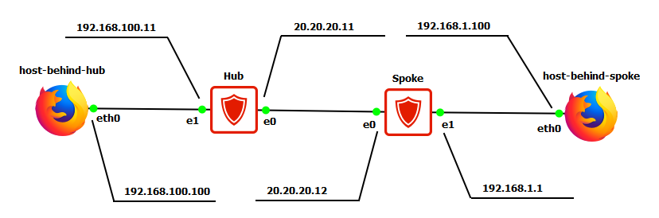

# 在受安全网关保护的两个子网之间建立 VPN 隧道。使用特定密钥进行身份验证

## 项目描述

此场景描述了中心办公室和分支机构受保护子网之间安全交互的配置。安全交互通过使用国内行业标准 GOST 和 IPsec 协议加密和隧道传输流量来实现。所有其他连接均允许，但不会受到 IPsec 的保护。在此场景中，使用预定义密钥进行身份验证。

## 基础设施要求

### 设备要求
1.1  任何与个人计算机功能类似的设备（webterm-new、Kali Linux CLI、Linux CLI 等）都可以用作主机后置……
### 网络要求
2.1 测试台设备之间必须确保IP连通性

## 网络拓扑


*图1 - 网络拓扑结构*

## 工作原理

### 设备部署
1.1 总部部署：C-Terra Gateway加密网关（Hub）和个人计算机（host_behind_hub）

1.2 分支机构部署：C-Terra Gateway加密网关（Spoke）和个人计算机（host_behind_spoke）

## Hub设备配置

### 初始化设备
1. **打开Hub虚拟机控制台**

   在安全网关Hub虚拟机窗口中，使用默认密码`s-terra`以`administrator`用户登录。登录时将显示消息：

   ```
   System is no initialized. Please run "initialize" command to start initialization procedure
   ```

   输入命令`initialize`并按Enter启动初始化过程。

2. **随机数生成器启动**

   在出现的窗口中启动随机数生成器。需要按照生成器窗口上指示的按键进行按压，直到初始化完成。

   ```
   Progress: [         ] 
   Press key: G
   ```

3. **输入安全网关许可证**

   输入С-Терра Шлюз的product code, customer code, license number, license code（许可证存储在"С-Терра许可证"文件中）。输入数据区分大小写：

   ```
   Enter product code: _ 
   Enter customer code: 
   Enter license number: 
   Enter license code:
   ```

   如果所有数据输入正确，确认其正确性：

   ```
   Is the above data correct? Y
   ```

   如果需要，同意重新创建网络接口名称映射文件：

   
   
   *图2 - 网络接口*

   输入许可证并确认输入数据正确性后，应启动IPsec驱动程序：

   ```
   Initialization completed. 
   Some settings will take effect after OS reboot only. 

   Network traffic is blocked. 
   To unblock network traffic, please setup network security policy 
   or use "run csconf_mgr activate" command to activate the predefined 
   permissive network security policy now.
   ```

   最初网关配置为阻止除DHCP外的所有网络流量。通过应用空安全策略更改此策略：

   ```bash
   run csconf_mgr activate
   ```

   至此网关初始化完成。转到Hub网关安全策略配置。使用`reboot`命令重启设备。

### 初始设置

在С-Терра Шлюз 4.3版本中实现了2个控制台，名称如下：

- 访问控制CLI（或Initial CLI）
- 加密网关 CLI（CGW CLI）

访问控制CLI用于本地认证，以及用于：
- 初始化
- 生成设备证书请求
- 将证书导入"С-Терра СиЭсПи"产品数据库
- 更新"С-Терра СиЭсПи"产品数据库中的关键信息
- 应用 S-Terra KP 的设置；
- 过渡到 CGW CLI

CGW CLI用于配置СКЗИ和МЭ功能。CGW CLI具有与Cisco IOS类似的语法（Cisco Like Console）。在控制台中使用TAB键自动补全。

1. **切换到Initial CLI控制台**

   默认数据用于Initial CLI：
   - 用户：administrator
   - 密码：s-terra

   成功访问控制台的示例：
   ```
   administrator@sterragate]_
   ```

2. **更改Initial CLI控制台的默认密码**

   将Initial CLI控制台的默认密码更改为培训密码MIET123（在网关运行过程中，Initial CLI用户的密码可以是任何密码），输入命令：

   ```bash
   administrator@sterragate] change user password

   Old user password: <旧密码> 
   New user password: <新密码> 
   Re-type new password: <重复新密码>
   ```

3. **切换到Linux控制台并更改root密码**

   输入命令`system`切换到设备的Linux控制台（root用户）。将默认root用户密码更改为培训密码miettcs，输入命令：

   ```bash
   administrator@sterragate] system 
   root@sterragate:# passwd 
   Enter new UNIX password: 
   Re-type new UNIX password: 

   passwd: password updated successfully
   ```

4. **退出root用户**

   输入命令`logout`退出root用户。

### 创建安全策略

网关配置通过Crypto Gateway CLI（CGW CLI）进行。

1. **切换到CGW CLI管理控制台**

   输入命令：

   ```bash
   administrator@sterragate] configure
   ```

   默认数据用于CGW CLI：
   - 用户：cscons
   - 密码：csp

   成功访问控制台的示例：
   ```
   sterragate#
   ```

2. **更改CGW CLI控制台的默认密码**

   将CGW CLI控制台的默认密码更改为培训密码miet（在网关运行过程中，CGW CLI用户的密码可以是任何密码），输入命令：

   ```bash
   sterragate#configure terminal 
   sterragate(config)#username cscons password <密码>
   ```

3. **设置网关名称**

   ```bash
   sterragate(config)#hostname Hub
   ```

4. **更改特权模式密码**

   使用更改后的参数切换到Crypto Gateway CLI控制台，并从配置模式将进入特权模式的密码更改为培训密码（russia）。输入命令：

   ```bash
   Hub(config)#enable secret 0 russia
   ```

   其中`0`表示以未加密形式输入密钥。

   **特权模式的默认密码**：csp

5. **配置接口IP地址**

   在接口设置中配置IP地址并将其设置为"no shutdown"模式（默认情况下网络接口已关闭）。

   ```bash
   Hub(config)#interface GigabitEthernet0/0 
   Hub(config-if)#ip address 20.20.20.11 255.255.255.0 
   Hub(config-if)#no shutdown 
   Hub(config-if)#exit 
   Hub(config)#interface GigabitEthernet0/1 
   Hub(config-if)#ip address 192.168.100.11 255.255.255.0 
   Hub(config-if)#no shutdown 
   Hub(config-if)#exit
   ```

6. **配置静态路由**

   配置到子网192.168.1.0/24的静态路由，通过Spoke网关：

   ```bash
   Hub(config)#ip route 192.168.1.0 255.255.255.0 20.20.20.12
   ```

7. **设置身份识别类型**

   ```bash
   Hub(config)#crypto isakmp identity address
   ```

8. **配置DPD参数**

   配置DPD（dead peer detection）参数以监控IPsec连接状态，其中第一条命令中的1表示无入站流量的时间段，3表示需要等待发送keepalived进程数据包（DPD请求）的秒数。第二条命令中的参数3表示等待合作伙伴响应DPD请求的时间：

   ```bash
   Hub(config)# crypto isakmp keepalive 1 3 
   Hub(config)# crypto isakmp keepalive retry-count 3
   ```

   DPD机制用于检测IKE连接中合作伙伴的故障。DPD发送周期性的keepalive消息，如果在指定时间间隔内没有收到IKE合作伙伴的响应，则删除当前隧道并尝试重新建立连接。

9. **配置IKE参数**

   ```bash
   Hub(config)# crypto isakmp policy 1 
   Hub(config-isakmp)# hash gost341112-256-tc26 
   Hub(config-isakmp)# authentication pre-share 
   Hub(config-isakmp)# group vko2 
   Hub(config-isakmp)# exit
   ```

10. **设置预定义密钥**

    设置预定义密钥（在此示例中密钥为KEY）：

    ```bash
    Hub(config)#crypto isakmp key KEY address 20.20.20.12
    ```

    **重要！** 根据使用规则，仅允许在测试目的中使用预定义密钥。在生产网络中必须使用数字证书认证。切换到证书在第2个实践工作中描述。

11. **配置IPsec转换集**

    ```bash
    Hub(config)# crypto ipsec transform-set GOST esp-gost28147-4m-imit 
    Hub(cfg-crypto-trans)#mode tunnel 
    Hub(cfg-crypto-trans)#exit
    ```

12. **定义要保护的流量**

    创建从网络192.168.100.0/24到网络192.168.1.0/24的扩展访问列表：

    ```bash
    Hub(config)#ip access-list extended LIST 
    Hub(config-ext-nacl)#permit ip 192.168.100.0 0.0.0.255 192.168.1.0 0.0.0.255 
    Hub(config-ext-nacl)#exit
    ```

13. **创建静态加密映射**

    创建静态加密映射（名称CMAP，部分1）：

    ```bash
    Hub(config)# crypto map CMAP 1 ipsec-isakmp
    ```

14. **指定需要保护的流量**

    ```bash
    Hub(config-crypto-map)# match address LIST
    ```

15. **指定流量保护算法**

    ```bash
    Hub(config-crypto-map)# set transform-set GOST
    ```

16. **指定IPsec连接中的合作伙伴IP地址**

    在本实验工作中，这是С-Терра Шлюз设备的外部IP地址（20.20.20.12）：

    ```bash
    Hub(config-crypto-map)# set peer 20.20.20.12 
    Hub(config-crypto-map)# exit 
    Hub(config)#
    ```

17. **将加密映射绑定到接口**

    将加密映射绑定到将终止隧道的接口：

    ```bash
    Hub(config)#interface GigabitEthernet0/0 
    Hub(config-if)#crypto map CMAP 
    Hub(config-if)#exit
    ```

18. **启用调试日志**

    为了以后可能在计算机上查看日志，在debugging模式下应用`logging trap`命令：

    ```bash
    Hub(config)#logging trap debugging 
    Hub(config)#exit 
    Hub#
    ```

默认情况下，所有设备日志都本地保存。如果需要，可以指定syslog服务器的IP地址。

Hub设备在cisco-like控制台中的配置已完成。退出配置模式时，配置将转换、保存并加载到"startup config"中。

cisco-like配置文本见实践课程附录。

## Spoke网关配置

安全网关的初始化、初始设置和密码更改与Hub配置类似，除了使用的许可证。网关配置同样从initial CLI和CGW CLI进行。从CGW CLI转到安全策略配置：

1. **设置Spoke网关名称**

   ```bash
   sterragate(config)#hostname Spoke
   ```

2. **配置接口IP地址**

   在接口设置中配置IP地址。

3. **配置静态路由**

   配置到子网192.168.100.0/24的静态路由，通过Hub网关。

4. **设置身份识别类型**

   ```bash
   Spoke(config)#crypto isakmp identity address
   ```

5. **配置DPD参数**

   配置DPD（dead peer detection）参数以监控IPsec连接状态。

6. **配置IKE参数**

   配置IKE参数（与Hub相同）。

7. **设置预定义密钥**

   设置预定义密钥（在此示例中密钥为KEY）。

8. **创建IPsec转换集**

   创建IPsec转换集。

9. **定义要保护的流量**

   创建从网络192.168.1.0/24到网络192.168.100.0/24的扩展访问列表。

10. **创建静态加密映射**

    创建静态加密映射（名称CMAP，部分1）。

11. **将加密映射绑定到接口**

    将加密映射绑定到将终止隧道的接口。

12. **启用调试日志**

    ```bash
    Spoke(config)#logging trap debugging 
    Spoke(config)#exit
    ```

Spoke设备在cisco-like控制台中的配置已完成。退出配置模式时，配置将转换并加载。

## host_behind_hub和host_behind_spoke设备配置

根据示意图为每个设备配置IP地址和默认网关。

## 测试台功能验证

1. **检查配置**

   在两个网关（Hub和Spoke）的控制台中从CGW CLI执行`show run`命令：

   ```bash
   Hub#sh run 
   ```

   确保配置相互对应（两个网关的配置中都有访问列表、加密映射部分、策略等）。配置检查是故障排除的第一步。

2. **测试网络连通性**

   在host_behind_spoke设备上从命令行执行ping命令（检查网络设备可达性）192.168.100.100：

   ```cmd
   C:\Users\User01>ping 192.168.100.100 

   正在 Ping 192.168.100.100 具有 32 字节的数据:

   来自 192.168.100.100 的回复: 字节=32 时间=596ms TTL=125
   来自 192.168.100.100 的回复: 字节=32 时间=8ms TTL=125
   来自 192.168.100.100 的回复: 字节=32 时间=9ms TTL=125
   来自 192.168.100.100 的回复: 字节=32 时间=8ms TTL=125

   192.168.100.100 的 Ping 统计信息:
       数据包: 已发送 = 4，已接收 = 4，丢失 = 0 (0% 丢失)，
   往返行程的估计时间(以毫秒为单位):
       最短 = 8ms，最长 = 596ms，平均 = 155ms
   ```

3. **验证安全连接**

   在Hub上验证受保护的IKE和IPsec连接的存在：

   ```bash
   Hub#show crypto isakmp sa 

   ISAKMP sessions: 0 initiated, 0 responded 

   ISAKMP connections: 
   Num Conn-id (Local Addr,Port)-(Remote Addr,Port) State Sent Rcvd 
   1 1 (20.20.20.12,500)-(20.20.20.11,500) active 1968 1836
   ```

   ```bash
   Hub#show crypto ipsec sa 

   IPsec connections: 
   Num Conn-id (Local Addr,Port)-(Remote Addr,Port) Protocol Action Type Sent Rcvd 
   1 1 (192.168.1.0-192.168.1.255,*)-(192.168.100.0-192.168.100.255,*) * ESP tunn 
   448 384
   ```

## 技术总结

本配置方案完整展示了在两个С-Терра Шлюз安全网关之间建立IPsec VPN隧道的全过程，包括：
- 设备初始化与许可证激活
- 基础网络配置
- IKE和IPsec策略配置
- 加密隧道建立与验证
- 网络连通性测试

所有配置步骤均采用俄罗斯国家标准GOST算法，确保通信安全符合行业标准要求。

*本项目展示了在С-Терра Шлюз安全网关之间建立IPsec VPN隧道的完整配置过程，适用于企业分支机构安全互联场景。*
