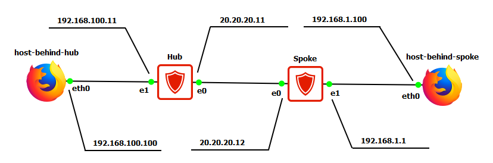
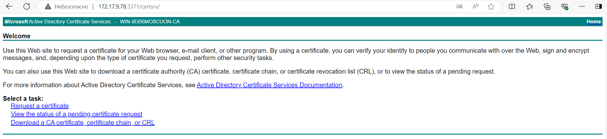
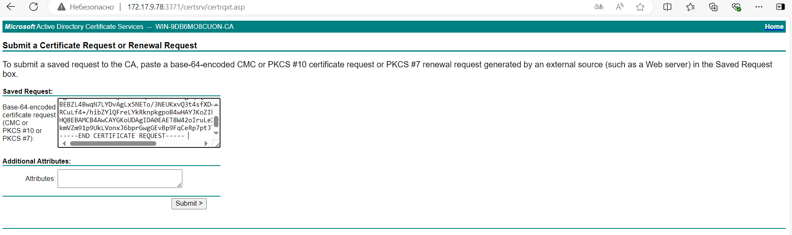

# 在受 S-Terra 网关保护的两个子网之间建立 VPN 隧道。迁移到证书。使用防火墙功能过滤流量

## 项目概述

本实践工作描述了从预定义密钥迁移到证书的过程。在程序结束时，在安全网关Hub上设置阻止ICMP流量到安全网关Spoke的规则。通过使用防火墙功能实现阻塞。安全交互通过使用俄罗斯国产行业标准GOST和IPsec协议进行流量加密和隧道传输来实现。

## 基础设施要求

### 设备要求
1.1 任何与个人计算机功能类似的设备（webterm-new、Kali Linux CLI、Linux CLI 等）都可以用作主机后置……

### 网络交互要求
2.1 测试台设备之间必须确保IP连通性

## 交互方案
<div align="center">
  
  <br>
  <em>图1 - 网络拓扑结构</em>
</div>

## 工作原理

### 设备部署
1.1 在总部部署：S-Terra 加密网关（Hub）和个人计算机（host_behind_hub）

1.2 在分支机构部署：S-Terra 加密网关（Spoke）和个人计算机（host_behind_spoke）

### 互联网连接

### 安全交互参数
总部子网（192.168.100.0/24）和分支机构子网（192.168.1.0/24）之间的所有IP流量都使用GOST算法和IPsec协议在隧道模式下进行保护。受保护的连接可以由从子网192.168.1.0/24到192.168.100.0/24（从分支机构到中心）的流量发起，反之亦然，从中心到分支机构。

3.1 **IKE协议参数**：
- 使用数字证书进行认证，签名算法 - GOST Р 34.10-2012（256位密钥）；
- 加密算法 - GOST 28147-89（256位密钥）；
- 哈希函数计算算法 - GOST Р 34.11-2012 ТК26（256位密钥）；
- 共同密钥生成算法（Diffie-Hellman算法的类似物） - VKO_GOSTR3410_2012_256（256位密钥）。

3.2 **ESP协议参数**：
- 加密和完整性保护（完整性控制）的组合算法 - ESP_GOST-4M-IMIT（256位密钥）。

## 为S-Terra 加密网关 Hub颁发证书

颁发证书需要SSH连接到Hub网关。由于我们在虚拟环境中使用虚拟机映像工作，GNS3程序已经提供到设备的远程连接。复制和安装证书需要telnet协议连接。在真实的С-Терра设备中，可以使用USB介质和/或集中使用С-Терра КП来导入证书。连接到设备后，需要执行以下步骤：

1. **登录root用户并检查日期时间**

   以root用户登录，输入必要密码（在第一个实验工作中设置为miettcs）。如果在连接过程中出现关于服务器主机密钥已更改的查询，请同意更改并单击"是"按钮。

   使用date命令检查当前日期和时间：

   ```bash
   root@Hub ~# date 
   Thu Feb 20 10:00:00 MSK 2020
   ```

   如有必要，更改当前日期和时间。网关上的错误时间可能导致证书方案无法工作。日期格式为MMDDHHMMYY（月日小时分钟年）。

   ```bash
   root@Hub ~# date 022514572021 
   Thu Feb 25 14:57:00 MSK 2021
   ```

   请注意，在这种情况下，时间显示为示例，需要输入实际值。

2. **生成本地证书请求**

   使用"cert_mgr"实用程序生成本地证书请求。在生成私钥过程中，将启动生物随机数生成器。

   ```bash
   root@Hub ~# cert_mgr create -subj "C=RU,OU=Study,CN=Hub" -GOST_R341012_256
   Progress[..........] 
   Press key: z 
   -----BEGIN CERTIFICATE REQUEST----- 
   MIIBBTCBtQIBADArMQswCQYDVQQGEwJSVTEOMAwGA1UECxMFU2FsZXMxDDAK 
   BgNVBAMTA0dXMTBjMBwGBiqFAwICEzASBgcqhQMCAiMBBgcqhQMCAh4BA0MA 
   BEBZL4BwqN7LYDvAgLx5NETo/3NEUKxvQ3t4sfXDcXFyydMGYhUFu+wDalRH 
   RCuLf4+/hibZYlQFreLYkRknpkgpoB4wHAYJKoZIhvcNAQkOMQ8wDTALBgNV 
   HQ8EBAMCB4AwCAYGKoUDAgIDA0EAET8W42oIruLeXlLEToWdU6Ujf3N4XqcW 
   kmVZm91p9UkLVonxJ6bprGwgGEvBp9FqCeRp7ptJTQxj2i3COxFCUw== 
   -----END CERTIFICATE REQUEST-----
   ```

   此命令将生成具有DN字段："C=RU,OU=Study,CN=GW1"的证书请求，使用GOST-Р 34.10.12-256公钥算法。证书请求生成完成后，它将安装到产品数据库中。可以通过运行带有show键的cert_mgr实用程序来验证：

   ```bash
   root@Hub ~# cert_mgr show 
   1 Status: request C=RU,OU=Study,CN=Hub
   ```

3. **访问证书颁发机构Web界面**

   通过Web浏览器访问CA（http://172.17.9.78:3371/certsrv/）以创建证书。

   <div align="center">
     
     <br>
     <em>图2 - CA Web服务器</em>
   </div>

4. **提交证书请求**

   选择"Request a certificate -> advanced certificate request -> To submit a saved request …"。将生成的请求复制到"Saved Request"字段中，然后单击"Submit"按钮。

   <div align="center">
     
     <br>
     <em>图3 - 复制本地CA证书</em>
   </div>

5. **下载证书**

   在下一个窗口中，单击"Download certificate"按钮，编码类型为"Base 64 encoded"。将收到的文件保存为Hub.cer。

   本地证书已保存。之后返回地址 - http://172.17.9.78:3371/certsrv/ 以保存CA证书。

6. **下载CA证书**

   选择"Download a CA certificate, certificate chain, or CRL"并单击"Download CA certificate"。将收到的文件保存为Ca.cer，编码类型与本地证书相同（"Base 64 encoded"）。

   <div align="center">
     
     <br>
     <em>图4 - 保存CA证书</em>
   </div>

7. **在网关上创建证书文件夹和文件**

   在网关上创建"/certs"文件夹，并在该文件夹中创建两个文件"ca.cer"和"hub.cer"。

   ```bash
   root@Hub ~# mkdir certs
   root@Hub ~# touch ca.cer
   root@Hub ~# touch hub.cer
   ```

8. **复制证书内容**

   将在PC上下载的"Hub.cer"和"Ca.cer"文件的内容复制到网上的"hub.cer"和"ca.cer"文件中。使用С-Терра Шлюз设备上的文本编辑器。以下是Nano编辑器的示例：

   ```bash
   root@Hub ~# nano ca.cer
   ```

   在控制台中通过右键单击进行插入。使用ctrl+O组合键保存文本文件并确认，ctrl+X关闭文本编辑器。

9. **注册证书**

   使用"cert_mgr"实用程序注册证书：

   ```bash
   root@Hub ~# cert_mgr import -f /certs/ca.cer –t

   1 OK C=RU,L=Moscow, O=S-Terra, CN=Presale Root CA 

   root@Hub ~# cert_mgr import -f /certs/hub.cer 

   1 OK C=RU,OU=Study,CN=Hub
   ```

   – t表示受信任的CA证书（trusted CA certificate）。
   – f指定文件路径。

10. **验证证书导入**

    确保证书已成功导入：

    ```bash
    root@Hub ~# cert_mgr show 

    Found 2 certificates. No CRLs found. 
    1 Status: trusted C=RU,L=Moscow, O=S-Terra, CN=Presale Root CA 
    2 Status: local C=RU,OU=Study,CN=Hub 

    root@Hub ~# cert_mgr check 

    1 State: Inactive C=RU,L=Moscow, O=S-Terra, CN=Presale Root CA 
     Certificate can not be verified. 
    2 State: Inactive C=RU,OU=Study,CN=Hub 
     Certificate can not be verified.
    ```

    由于默认启用了撤销证书列表（CRL）检查，证书处于非活动状态。要使证书变为活动状态，需要注册CRL或禁用其检查。在本实践工作中，您将通过cisco-like控制台禁用检查。

## 为S-Terra 加密网关 Spoke颁发证书

1. 以root用户登录Spoke网关设置
2. 检查并在必要时正确设置日期和时间，类似于Hub网关
3. 创建证书请求，将"CN"字段更改为Spoke
4. 将生成的请求复制到CA并保存收到的证书为"Spoke"
5. 将"Spoke.cer"文件的内容传输到Spoke网关的"/certs"文件夹中的"spoke.cer"，并将根证书"Ca.cer"的内容传输到"ca.cer"
6. 将传输的证书导入产品数据库
7. 确保证书已成功导入

## 更改Hub网关的安全策略和过滤规则

1. **进入配置模式**

   在两个网关上成功导入证书后，更改网关上的安全策略以使用数字证书（取消预定义密钥的认证）。

   ```bash
   [root@Hub bin]# cs_console 
   Hub>en 
   Password: 
   Hub#conf t 
   Enter configuration commands, one per line. End with CNTL/Z. 
   Hub(config)#
   ```

2. **删除预共享密钥**

   ```bash
   Hub(config)#no crypto isakmp key KEY address 20.20.20.12
   ```

3. **更改身份识别类型**

   ```bash
   Hub(config)#crypto isakmp identity dn
   ```

4. **更改IKE参数**

   ```bash
   Hub(config)#crypto isakmp policy 1 
   Hub(config-isakmp)#authentication gost-sig 
   Hub(config-isakmp)#exit
   ```

5. **禁用CRL处理**

   ```bash
   Hub(config)#crypto pki trustpoint s-terra_technological_trustpoint 
   Hub(ca-trustpoint)#revocation-check none 
   Hub(ca-trustpoint)#exit
   ```

6. **配置过滤策略**

   在安全网关上配置过滤策略，以阻止从host_behind_spoke到Hub网关外部地址的ICMP流量。

   ```bash
   Hub(config)#ip access-list extended FW 
   Hub(config-ext-nacl)#deny icmp host 192.168.1.100 host 20.20.20.11 
   Hub(config-ext-nacl)# permit ip any any 
   Hub(config-ext-nacl)# exit 
   Hub(config)#
   ```

7. **将访问列表绑定到接口**

   将"FW"访问列表绑定到具有加密映射的接口（GigabitEthernet 0/0）

   ```bash
   Hub(config)# interface GigabitEthernet 0/0 
   Hub(config-if)# ip access-group FW in 
   Hub(config-if)#exit 
   Hub(config)#exit 
   Hub#
   ```

Hub设备配置完成。退出配置模式时，配置将加载。

## 更改Spoke网关的安全策略

Spoke网关的配置类似于Hub网关的配置，除了过滤ACL的设置。
将网关的安全策略更改为以下内容：

```bash
[root@Spoke bin]# cs_console 
Spoke >en 
Password: 
Spoke #conf t 
Spoke(config)# 
Spoke(config)#no crypto isakmp key KEY address 20.20.20.11 
Spoke(config)#crypto isakmp identity dn 
Spoke(config)#crypto isakmp policy 1 
Spoke(config-isakmp)#authentication gost-sig 
Spoke(config-isakmp)#exit 
Spoke(config)#crypto pki trustpoint s-terra_technological_trustpoint 
Spoke(ca-trustpoint)#revocation-check none 
Spoke(ca-trustpoint)#exit 
Spoke(config)#exit 
Spoke#exit
```

Spoke设备配置完成。退出配置模式时，配置将加载。

## 测试台功能验证

1. **测试网络连通性**

   在host_behind_spoke设备上执行ping 192.168.100.100命令

   ```cmd
   C:\Users\User01>ping 192.168.100.100

   正在 Ping 192.168.100.100 具有 32 字节的数据:

   来自 192.168.100.100 的回复: 字节=32 时间=443ms TTL=125
   来自 192.168.100.100 的回复: 字节=32 时间=8ms TTL=125
   来自 192.168.100.100 的回复: 字节=32 时间=9ms TTL=125
   来自 192.168.100.100 的回复: 字节=32 时间=8ms TTL=125

   192.168.100.100 的 Ping 统计信息:
       数据包: 已发送 = 4，已接收 = 4，丢失 = 0 (0% 丢失)，
   往返行程的估计时间(以毫秒为单位):
       最短 = 8ms，最长 = 443ms，平均 = 117ms
   ```

2. **验证安全连接**

   在Hub上验证受保护的IKE和IPsec连接的存在：

   ```bash
   Hub#show crypto isakmp sa 

   ISAKMP sessions: 0 initiated, 0 responded 

   ISAKMP connections: 
   Num Conn-id (Local Addr,Port)-(Remote Addr,Port) State Sent Rcvd 
   1 1 (20.20.20.12,500)-(20.20.20.11,500) active 1856 1764 
   ```

   ```bash
   Hub#show crypto ipsec sa 

   IPsec connections: 
   Num Conn-id (Local Addr,Port)-(Remote Addr,Port) Protocol Action Type Sent Rcvd 
   1 1 (192.168.1.0-192.168.1.255,*)-(192.168.100.0-192.168.100.255,*) * ESP tunn 
   304 368
   ```

   可以看到，Hub和Spoke设备之间的安全连接已成功建立。

3. **验证证书状态**

   cert_mgr show命令的输出显示网关已交换证书。Spoke网关的证书对于Hub网关是remote状态。在Spoke网关上，Hub的证书具有remote状态。

   ```bash
   Hub#run cert_mgr show 

   1 Status: trusted C=RU,L=Moscow,O=S-Terra,CN=Presale Root CA 
   2 Status: local C=RU,OU=Study,CN=Hub 
   3 Status: remote C=RU,OU=Study,CN=Spoke
   ```

4. **验证证书活动状态**

   cert_mgr check命令的输出显示所有证书的状态均为active，因为我们禁用了与撤销证书列表（CRL）的比对：

   ```bash
   GW1#run cert_mgr check 

   1 State: Active C=RU,L=Moscow,O=S-Terra,CN=Presale Root CA 
   2 State: Active C=RU,OU=Study,CN=Hub 
   3 State: Active C=RU,OU=Study,CN=Spoke
   ```

5. **验证防火墙规则**

   现在让我们验证防火墙规则的功能。在host_behind_spoke设备上执行ping 20.20.20.11命令。根据Hub上设置的安全策略，流量将被阻止：

   ```cmd
   C:\Users\User01>ping 20.20.20.11

   正在 Ping 20.20.20.11 具有 32 字节的数据:

   请求超时
   请求超时
   请求超时
   请求超时

   20.20.20.11 的 Ping 统计信息:
       数据包: 已发送 = 4，已接收 = 0，丢失 = 4 (100% 丢失)，
   ```

## 技术总结

本实践工作完整展示了：
- 从预共享密钥迁移到数字证书认证的过程
- 证书请求生成和CA证书管理
- IKE/IPsec策略更新为使用GOST签名算法
- 防火墙规则配置实现流量过滤
- 完整的连接验证和故障排除流程

通过此配置，实现了更高级别的安全认证和精细的流量控制能力。
