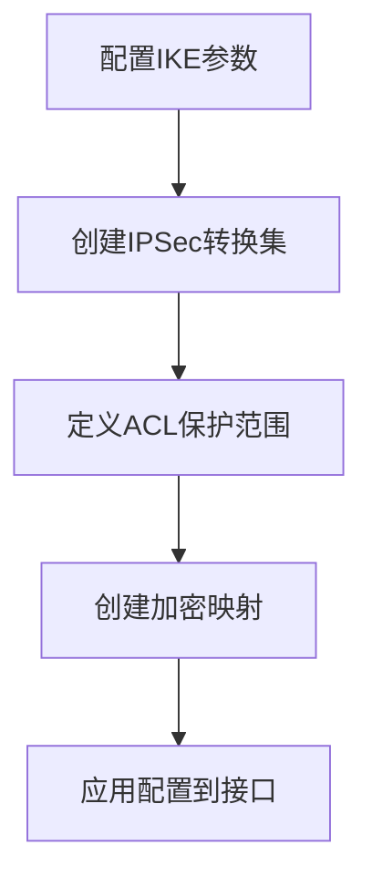
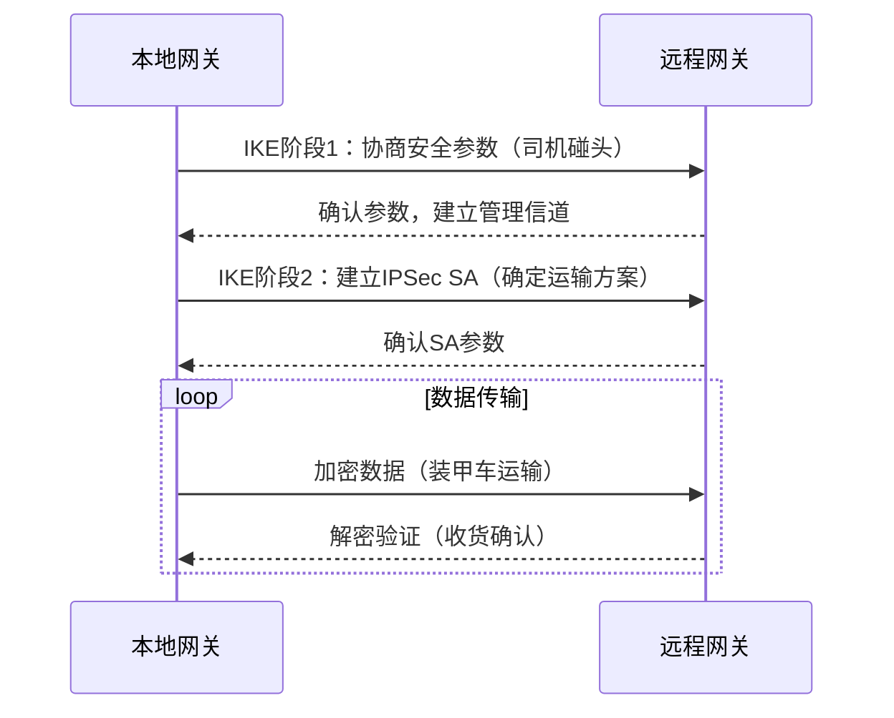

**基于证书认证 + 防火墙的 IPsec VPN 完整配置**（适用于 GNS3 + С-Терра Шлюз 实验环境）。
本配置完全基于前面实验 №2 的要求：

* 不使用 `crypto isakmp key`（改用数字证书认证）
* 启用 ГОСТ 加密算法
* Hub 端设置防火墙阻止 ICMP
* Spoke 与 Hub 之间建立基于证书的 IPsec 隧道

---

# 📘 实验2：基于证书认证 + 防火墙的 IPsec VPN（完整命令版）

---

## 🌐 拓扑结构

```
[Host_behind_Hub]──192.168.100.0/24──(Hub)──20.20.20.11──||VPN隧道||──20.20.20.12──(Spoke)──192.168.1.0/24──[Host_behind_Spoke]
```

---

## 🧩 一、Hub 端配置（20.20.20.11）

### 1️⃣ 初始化与接口配置

```bash
configure terminal
hostname Hub                                   # 设置设备名称为 Hub
!
interface eth0
 ip address 20.20.20.11 255.255.255.0          # 配置外网接口 IP
 no shutdown                                   # 启用接口
exit
!
interface eth1
 ip address 192.168.100.1 255.255.255.0        # 配置内网接口 IP
 no shutdown
exit
!
ip route 192.168.1.0 255.255.255.0 20.20.20.12 # 静态路由到 Spoke 内网
```

---

### 2️⃣ 证书导入与信任建立

```bash
# 进入 Linux shell 执行证书管理
run cert_mgr create -subj "C=RU,OU=Lab,CN=Hub" -GOST_R341012_256     # 生成 Hub 的证书请求 (CSR)
# 将输出内容提交到 CA（证书中心）生成 hub.cer 和 ca.cer 文件

mkdir /certs                                 # 创建存放证书的目录
copy tftp://<CA-IP>/hub.cer /certs/          # 从 CA 下载已签发的 Hub 证书
copy tftp://<CA-IP>/ca.cer /certs/           # 下载 CA 根证书

cert_mgr import -f /certs/ca.cer -t           # 导入 CA 根证书并设为信任根
cert_mgr import -f /certs/hub.cer             # 导入 Hub 自身证书
cert_mgr show                                 # 查看已导入的证书列表
cert_mgr check                                # 检查证书状态（应为 Active）
```

---

### 3️⃣ IKE（基于证书的认证）

```bash
crypto isakmp identity dn                     # 使用证书的 Distinguished Name (DN) 作为身份标识
crypto isakmp policy 1                        # 创建 IKE 策略组
 hash gost341112-256-tc26                     # 使用 ГОСТ 哈希算法
 authentication gost-sig                      # 使用证书签名认证
 group vko2                                   # ГОСТ 密钥交换组
 lifetime 3600                                # SA 生命周期（秒）
exit
!
crypto pki trustpoint s-terra_technological_trustpoint  # 指定信任点（使用已导入 CA）
 revocation-check none                        # 不检查证书吊销列表（实验环境）
exit
```

---

### 4️⃣ IPsec 加密配置

```bash
crypto ipsec transform-set GOST esp-gost28147-4m-imit   # 设置 ГОСТ 加密 + 完整性算法
 mode tunnel                                             # 使用隧道模式
exit

ip access-list extended VPN_ACL
 permit ip 192.168.100.0 0.0.0.255 192.168.1.0 0.0.0.255 # 定义要加密的流量（Hub⇄Spoke 内网）
exit

crypto map CMAP 10 ipsec-isakmp
 set peer 20.20.20.12                     # 对端地址（Spoke 外网 IP）
 set transform-set GOST                   # 使用上面定义的加密集
 match address VPN_ACL                    # 匹配流量 ACL
exit

interface eth0
 crypto map CMAP                          # 绑定加密映射到外网接口
```

---

### 5️⃣ 防火墙配置（阻止 ICMP）

```bash
ip access-list extended FW_FILTER
 deny icmp any any                        # 阻止所有 ICMP（示例）
 permit ip any any                        # 允许其他 IP 流量
exit

interface eth0
 ip access-group FW_FILTER in              # 将防火墙规则应用于外网接口（入站方向）
```

---

### 6️⃣ 验证配置

```bash
write memory                              # 保存配置
show crypto isakmp sa                     # 查看 IKE 隧道状态
show crypto ipsec sa                      # 查看 IPsec 隧道状态
cert_mgr show                             # 检查证书状态
```

✅ **期望结果：**

```
ISAKMP SA: established
IPsec SA: active
Ping 192.168.1.100 → 成功
Ping 20.20.20.12 → Timeout（防火墙阻止 ICMP）
```

---

## 🧩 二、Spoke 端配置（20.20.20.12）

### 1️⃣ 接口与路由

```bash
configure terminal
hostname Spoke
!
interface eth0
 ip address 20.20.20.12 255.255.255.0          # 外网接口
 no shutdown
exit
!
interface eth1
 ip address 192.168.1.1 255.255.255.0          # 内网接口
 no shutdown
exit
!
ip route 192.168.100.0 255.255.255.0 20.20.20.11  # 到 Hub 内网的静态路由
```

---

### 2️⃣ 证书导入与信任

```bash
run cert_mgr create -subj "C=RU,OU=Lab,CN=Spoke" -GOST_R341012_256    # 生成 Spoke 证书请求
# 将输出内容提交到 CA 获取 spoke.cer 和 ca.cer 文件

mkdir /certs
copy tftp://<CA-IP>/spoke.cer /certs/
copy tftp://<CA-IP>/ca.cer /certs/

cert_mgr import -f /certs/ca.cer -t             # 导入根证书
cert_mgr import -f /certs/spoke.cer             # 导入 Spoke 证书
cert_mgr check                                  # 验证状态应为 Active
```

---

### 3️⃣ IKE（证书认证）

```bash
crypto isakmp identity dn                       # 使用证书 DN 作为身份
crypto isakmp policy 1
 hash gost341112-256-tc26                       # ГОСТ 哈希算法
 authentication gost-sig                        # 使用证书签名认证
 group vko2                                     # ГОСТ 密钥交换组
 lifetime 3600
exit
!
crypto pki trustpoint s-terra_technological_trustpoint
 revocation-check none
exit
```

---

### 4️⃣ IPsec 配置

```bash
crypto ipsec transform-set GOST esp-gost28147-4m-imit
 mode tunnel
exit

ip access-list extended VPN_ACL
 permit ip 192.168.1.0 0.0.0.255 192.168.100.0 0.0.0.255   # 保护 Spoke⇄Hub 内网流量
exit

crypto map CMAP 10 ipsec-isakmp
 set peer 20.20.20.11
 set transform-set GOST
 match address VPN_ACL
exit

interface eth0
 crypto map CMAP
```

---

### 5️⃣ 验证

```bash
write memory
show crypto isakmp sa
show crypto ipsec sa
cert_mgr show
ping 192.168.100.100          # 应成功（加密隧道）
ping 20.20.20.11              # 应超时（被 Hub 防火墙阻止）
```

✅ **期望结果：**

```
ISAKMP SA: established
IPsec SA: established
ICMP echo to 20.20.20.11: blocked by firewall
```

---

## ✅ 三、配置完成后验证流程

| 验证步骤         | 目标            | 设备          | 命令                      |
| ------------ | ------------- | ----------- | ----------------------- |
| 1️⃣ 证书状态     | 确认证书有效        | Hub / Spoke | `cert_mgr show`         |
| 2️⃣ IKE 状态   | 查看身份协商        | Hub / Spoke | `show crypto isakmp sa` |
| 3️⃣ IPsec 状态 | 查看隧道状态        | Hub / Spoke | `show crypto ipsec sa`  |
| 4️⃣ 防火墙验证    | 测试 ICMP 是否被阻止 | Hub         | `ping` 测试               |
| 5️⃣ 隧道流量     | 测试内部连通性       | Spoke       | `ping 192.168.100.100`  |

---
# IPSec VPN 核心组件详解：基于运输比喻的解析

## 🚚 汽车运输比喻
想象你要运送贵重物品：
- **IKE** = 双方司机见面协商运输规则（走哪条路，用什么车）
- **IPSec** = 实际的装甲运输车队和安全措施
- **加密映射** = 整体运输计划书
- **ACL** = 物品清单（规定什么东西需要特殊保护）

---

## 🔍 详细分解

### 1. IKE（Internet Key Exchange）- "谈判代表"
**作用**：负责VPN建立前的身份认证和安全参数协商

**相当于**：两个公司的物流经理见面，商定：


**关键任务**：
- 如何识别对方身份（出示工作证）
- 用什么车辆运输（加密算法选择）
- 走哪条路线（传输协议选择）
- 多长时间更换一次密码（密钥生存时间）

**技术实现**：
```bash
crypto isakmp policy 1
authentication gost-sig# 身份验证方式
encryption aes256# 加密算法
hash sha512# 哈希算法
group 24# DH组（密钥交换强度）
lifetime 86400# 密钥生存时间(秒)
```

---

### 2. IPSec - "保安部队"
**作用**：实际的数据加密、封装和传输

**核心组件**：转换集（Transform Set）
```bash
crypto ipsec transform-set SECURE_TRANSFORM esp-aes256 esp-sha512-hmac
mode tunnel
```

**包含三个要素**：
| **要素** | **功能** | **比喻** | **选项示例** |
|----------|----------|----------|--------------|
| **加密算法** | 数据保密性 | 用什么锁具 | `esp-aes256`, `esp-gost` |
| **完整性算法** | 防篡改 | 如何密封包装 | `esp-sha512-hmac`, `esp-gost-mac` |
| **封装模式** | 数据封装方式 | 整个装箱方式 | `tunnel`(隧道模式), `transport`(传输模式) |

**相当于**：具体的安全措施
- 装甲车的防弹级别（加密强度）
- 货物密封检测机制（完整性检查）
- 集装箱装载方式（封装模式）

---

### 3. ACL（Access Control List）- "货物清单"
**作用**：定义哪些流量需要VPN保护

**相当于**：一份详细的物品清单


**实际配置示例**：
```bash
ip access-list extended VPN_TRAFFIC
permit ip 192.168.100.0 0.0.0.255 192.168.1.0 0.0.0.255# 总部⇄分支1
permit ip 192.168.100.0 0.0.0.255 192.168.2.0 0.0.0.255# 总部⇄分支2
permit ip 192.168.1.0 0.0.0.255 192.168.2.0 0.0.0.255# 分支1⇄分支2
```

---

### 4. 加密映射（Crypto Map）- "总体运输方案"
**作用**：整合所有组件形成完整的VPN策略

**配置结构**：
```bash
crypto map MAIN_VPN 10 ipsec-isakmp
match address VPN_TRAFFIC# 引用ACL(货物清单)
set transform-set SECURE_TRANSFORM # 引用IPSec转换集(保安措施)
set peer 203.0.113.5# 指定目的地(对端网关)
set dead-connection history off# NAT穿透优化
```

**相当于**：完整的运输方案书，包含：
- 哪些货物需要特殊保护（ACL）
- 使用什么安全措施（转换集）
- 运往何处（对端网关地址）
- 特殊注意事项（NAT穿透设置）

---

## ⚙️ 配置顺序（关键路径）

### 正确的工作流程


### 分步配置指南
```bash
# 1. 先配置IKE（建立信任基础）
crypto isakmp policy 100
authentication gost-sig
encryption aes256
hash sha512
group 21
lifetime 28800

# 2. 创建IPSec转换集（定义安全协议）
crypto ipsec transform-set SECURE_TRANSFORM esp-aes256 esp-sha512-hmac
mode tunnel

# 3. 定义ACL（明确保护范围）
ip access-list extended VPN_TRAFFIC
permit ip 192.168.100.0 0.0.0.255 192.168.1.0 0.0.0.255
permit ip 192.168.100.0 0.0.0.255 192.168.2.0 0.0.0.255

# 4. 创建加密映射（整合所有组件）
crypto map MAIN_VPN 10 ipsec-isakmp
match address VPN_TRAFFIC
set transform-set SECURE_TRANSFORM
set peer 203.0.113.5
set dead-connection history off

# 5. 应用到物理接口
interface GigabitEthernet0/0
crypto map MAIN_VPN
```

> **关键提醒**：配置顺序错误是VPN建立失败的常见原因！必须严格按照：IKE → 转换集 → ACL → 加密映射 → 接口应用的顺序操作。

---

## 💡 总结：组件协同工作原理



**完整VPN建立流程**：
1. IKE协商建立管理信道（Phase 1）
2. IPSec SA协商确定加密参数（Phase 2）
3. ACL匹配流量触发加密
4. 加密映射整合所有参数实现安全传输
5. 转换集提供实际的数据保护
